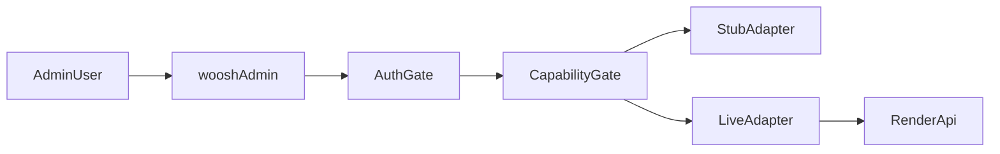

# Woosh Admin — Build Plan

Standalone Next.js admin dashboard for Woosh operations. Separate from the marketing website (`woosh-website`).

## Roadmap source

- Expected folder: `C:/Users/kevin/Desktop/Woosh/Admin Panel -20260628T195508Z-3-001`
- **Status (July 2026):** folder was not discoverable from Cursor at implementation time.
- **Fallback source of truth:** [Desktop Woosh API docs](../Desktop/Woosh/API/API_DOCUMENTATION.md) (external) and `docs/API_READINESS.md` in this repo.

## Screen inventory

Reconciled from API documentation and planned admin modules:

- Dashboard
- Login / auth
- Orders list + order detail + reviews
- Services, slots, package pricing, memberships
- Coupons, media, referrals
- Customers + wallet
- Employees, jobs, attendance, incentives
- Inventory
- Support tickets, audit log, settings
- API readiness (internal)

See [`API_READINESS.md`](./API_READINESS.md) for capability state per screen.

## Architecture

- **Repo:** `woosh-admin` (this project)
- **Stack:** Next.js 15 App Router, TypeScript, Tailwind CSS v4, pnpm
- **Backend:** `https://car-wash-vbry.onrender.com/api`
- **Pattern:** capability-gated modules with typed API contracts and stub/live adapters



## Security gate (mandatory)

Many admin routes on the backend currently have **no auth middleware** (documented in API reference). Therefore:

- **Do not** launch public production admin until backend admin auth + RBAC exist.
- **Acceptable for internal preview:** Vercel deployment protection + stub-first capability mode.
- **Not acceptable:** public `admin.getwoosh.com` calling unauthenticated admin endpoints.

See [`SECURITY.md`](./SECURITY.md).

## Phased build

### Phase 0 — Validation (done in scaffold)

- Document roadmap availability
- Screen inventory + API readiness matrix
- Security decision recorded

### Phase 1 — Scaffold (current)

- App shell, sidebar, login, capability config
- Stub adapters for operational modules
- API readiness page

### Phase 2 — Live adapters (after backend auth)

- Flip modules from `blocked_security` → `live` in `lib/capabilities.ts`
- Implement live adapters under `lib/api/adapters/live/`
- Enable `ADMIN_ALLOW_UNPROTECTED_API=true` only in trusted internal environments

### Phase 3 — Missing APIs

- Dashboard KPIs (`GET /admin/metrics/overview`)
- Customer directory (`GET /admin/customers`)
- Support tickets, audit log, RBAC settings

### Phase 4 — Production launch

- Backend admin auth verified
- Audit logging for write actions
- Protected production domain
- Full regression + E2E against staging API

## Environment variables

| Variable | Default | Purpose |
|----------|---------|---------|
| `NEXT_PUBLIC_API_BASE_URL` | Render API URL | Backend root |
| `NEXT_PUBLIC_ADMIN_CAPABILITY_MODE` | `stub-first` | Safe default |
| `ADMIN_REQUIRE_AUTH` | `true` | Gate routes |
| `ADMIN_ALLOW_UNPROTECTED_API` | `false` | Block live admin calls in preview |
| `NEXT_PUBLIC_APP_ENV` | `local` / Vercel env | Environment badge |

## Testing

```bash
pnpm lint
pnpm test:unit
pnpm test:e2e
pnpm verify
```

- **Unit:** capabilities, API client errors, module gate rendering
- **E2E:** login, dashboard demo badge, API readiness page
- **Integration (later):** live API smoke against staging with secrets in CI only

## Deployment

See [`DEPLOYMENT.md`](./DEPLOYMENT.md).

- Vercel project: `woosh-admin`
- Standard Next.js deploy (not static export)
- Preview protected until launch sign-off

## PR breakdown

1. Scaffold + docs + capability layer
2. Auth shell + dashboard + API readiness
3. Orders module
4. Catalog modules (services, slots, pricing)
5. People + operations modules
6. Deploy hardening + integration tests

## Backend API request backlog

High priority gaps for backend team:

- `POST /admin/auth/login`, `GET /admin/auth/me`, RBAC claims
- Middleware protecting all admin routes
- `GET /admin/metrics/overview`
- `GET /admin/customers` (+ search)
- Support ticket CRUD
- `GET /admin/audit-log`
- Coupon update/delete endpoints
